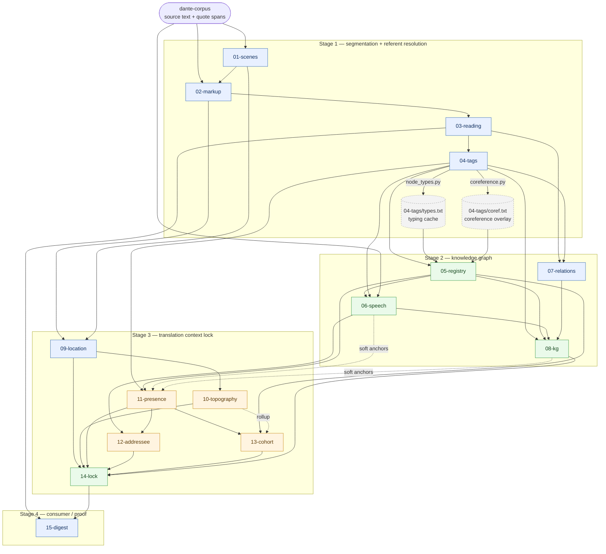

# Overview

A single-page map of the whole pipeline: how the analysis flows from Dante's source text to a
referent-resolved knowledge graph, a per-scene translation context lock, and the digest edition that
proves the lock holds. For usage and per-stage prose see [`README.md`](README.md); for the durable
engineering rules behind every pass see [`ARCHITECTURE.md`](ARCHITECTURE.md).

The pipeline turns the poem into structured data in fifteen numbered passes. Every pass follows one
spine — **the model proposes; code checks, normalizes, joins, and resumes** — so the LLM is called
only on the genuine residual and every output is validated by code. By the *Premise* (see
[`README.md`](README.md)), no external canon (known geography, identities, glossed periphrases) is
ever fed into a pass; the poem's known facts are an evaluation set, never an input, which is what
keeps the method transferable to obscure works.

## The four stages

| Stage | Passes | Produces |
|-------|--------|----------|
| **Segmentation + referent resolution** | 01–04 | scenes, marked mentions, free readings, one identity per tag |
| **Knowledge graph** | 05–08 | canonical nodes, speakers, event edges, assembled JSONL graph |
| **Translation context lock** | 09–14 | location, region, presence, addressee, cohort → the per-scene lock |
| **Consumer / proof** | 15 | bilingual digest, plus the code-only conformance proof of the lock |

All three canticles (100 cantos) are complete and committed through 15-digest.

## Dependency graph

**Legend:** 🟦 LLM · 🟩 pure code · 🟧 hybrid (code-first / code-named, LLM on the residual) · ⬚ cache/overlay store. Dotted edges are soft anchors / auxiliary inputs, not the primary data path.

## Per-pass reference

Each pass writes per-canto checkpoint files; see the linked README for run commands, model choice,
and measured results.

| Pass | Purpose | Reads | Writes | Type | Key check |
|------|---------|-------|--------|------|-----------|
| [01-scenes](01-scenes/README.md) | Cut each canto into ordered gap-free scenes | corpus | `NN.json`, `<canticle>.md` | LLM (+CoT plan) | ranges cover canto, no gap/overlap |
| [02-markup](02-markup/README.md) | Mark every person reference inline (not resolve) | corpus, 01 | `NN.txt` | LLM (+CoT) | round-trip: strip marks ⇒ source verbatim |
| [03-reading](03-reading/README.md) | Free prose reading per scene — the source of truth for WHO | 02, 01 | `NN.txt` | LLM (+CoT) | none (free prose; errors accepted as data) |
| [04-tags](04-tags/README.md) | Enumerate the reading's identifications, one `n. Name` per tag | 03, 02 | `NN.txt`; `types.txt`, `coref.txt` | LLM (+CoT) | every tag named once; pronoun ≠ own surface |
| [05-registry](05-registry/README.md) | Fold labels into one canonical node per figure, typed | 04, `types.txt`, `coref.txt`, `aliases.txt` | `<canticle>.txt` | code | every label assigned once; type in vocabulary |
| [06-speech](06-speech/README.md) | Speaker per quote span via first-person referent join | 05, 04, corpus | `NN.txt` | code | round-trip; every span emitted once |
| [07-relations](07-relations/README.md) | Event edges per scene over a closed predicate vocabulary | 03, 04 | `NN.txt` | LLM (+CoT) | cited `[n]` exists; predicate/frame/lines valid |
| [08-kg](08-kg/README.md) | Assemble the graph: join edges + speakers → JSONL | 04, 05, 06, 07 | `nodes/edges/speech_edges.jsonl` | code | geometry: each edge in one scene, `[n]` exists |
| [09-location](09-location/README.md) | Current physical setting per scene, source place-words | 02, 01 (self-recap) | `NN.txt` | LLM (+CoT) | basis range within scene |
| [10-topography](10-topography/README.md) | Fold settings into canonical regions (positional walk) | 09 | `<canticle>.txt`, `.clusters.txt` | hybrid (LLM boundary, code naming) | every term gets a region |
| [11-presence](11-presence/README.md) | Label roster figures present vs mentioned | 04, 05 (roster); 06, 08 (soft anchors) | `NN.txt` | code + LLM | closed-set roster; basis within scene |
| [12-addressee](12-addressee/README.md) | Who each speech span is addressed to | 06, 11 | `NN.txt` | hybrid (code-first, LLM ≥2) | addressee in candidate pool; basis in span |
| [13-cohort](13-cohort/README.md) | Resident soul-class per scene, + per-region rollup | 11, 05, 10 (rollup) | `NN.txt`, `<canticle>.txt` | hybrid (code-first, LLM ≥2) | cohort in candidate list; basis within scene |
| [14-lock](14-lock/README.md) | Final join: all five layers + KG → per-scene lock | 09, 10, 11, 12, 13, 08 | `NN.toml` | code | one entry/scene; region totality; basis ranges |
| [15-digest](15-digest/README.md) | Bilingual retelling bounded to the lock vocabulary | 03, 14, 01 | `NN.txt` | LLM (+CoT); code proof | conformance: names/settings ∈ lock vocabulary |

## Code vs LLM split

Code narrows each item to a candidate set before any model call: zero or one candidate is resolved
by code, and only a genuine residual of two-or-more candidates reaches the model — and even then as
a pick from a closed set, not free generation. Joins are by stable ids (tag numbers, canonical
nodes), never by re-reading text. This is why the hybrid lock passes (12/13) resolve a majority of
units in code, and why the pure-code passes (05/06/08/14) carry no LLM at all. The rationale and the
full rule set live in [`ARCHITECTURE.md`](ARCHITECTURE.md).

## Rebuild & invalidation

A node-set change does **not** auto-propagate uniformly. The pure-code passes (06, 08, 14) reflect a
new node set the moment they rerun (08 re-joins 07's edges along the way). The caching LLM/identity
passes (09, 10, 11, 12, 13, 15) store finished cantos and **silently skip** changed ones, so they
need a manual cache clear for the affected cantos before rerun. The always-correct fallback is a full
clean (`make clean && make` across 11→15). The rebuild order, the per-pass cache list, and the open
granular-invalidation problem are tracked in [`KG-PROBLEM.md`](KG-PROBLEM.md).

## Status

Complete and committed for all three canticles (100 cantos) through 15-digest; the digest stays
within the lock vocabulary 99.5% of the time, with every residual non-name material. Optional next
directions are listed in [`PLAN.md`](PLAN.md).
